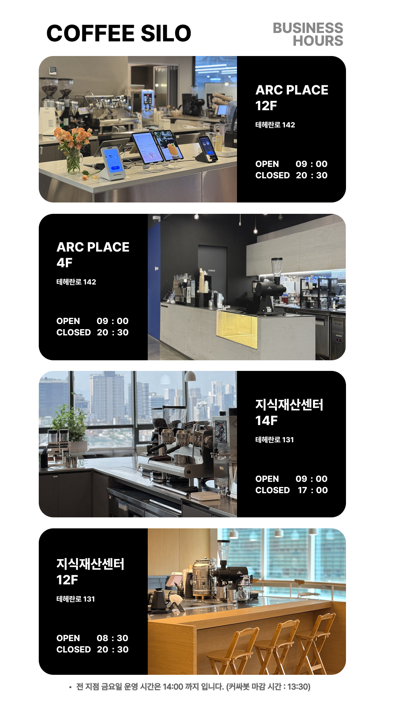

# Coffee Silo 이미지 갤러리

7개 탭으로 구성된 세로 이미지 슬라이드쇼 갤러리입니다.

## GitHub Pages 배포 방법

### 1. 파일 업로드
1. `coffee-silo.html` 파일 이름을 **`index.html`**로 변경
2. GitHub 저장소에 `index.html` 업로드

### 2. 이미지 폴더 구조 만들기
저장소에 다음과 같은 폴더 구조를 만드세요:

```
your-repository/
├── index.html
└── images/
    ├── tab1/    (아크 12F)
    ├── tab2/    (아크 4F)
    ├── tab3/    (지재센 12F)
    ├── tab4/    (지재센 14F)
    ├── tab5/    (피나클 2F)
    ├── tab6/    (한타 7F)
    └── tab7/    (신논현 토스 오피스)
```

### 3. 이미지 업로드
각 탭 폴더에 이미지를 업로드하세요:
- 파일명: `1.jpg`, `2.jpg`, `3.jpg` ...
- 권장 비율: 9:16 (세로)

### 4. HTML 코드 수정
`index.html` 파일을 열어서 각 탭의 슬라이드 부분을 수정하세요.

#### 예시: tab1 (아크 12F)
```html
<div class="slideshow" id="slideshow-tab1" data-tab="tab1">
    <div class="slide active">
        
    </div>
    <div class="slide">
        
    </div>
    <div class="slide">
        
    </div>
    <button class="close-fullscreen">×</button>
</div>
```

**주의사항:**
- 첫 번째 슬라이드에만 `class="slide active"` 사용
- 나머지는 `class="slide"` 사용

### 5. GitHub Pages 활성화
1. 저장소 Settings > Pages
2. Source: main branch, / (root)
3. Save

## 사용 방법

### 방문자
- 탭을 클릭하여 각 장소 선택
- "▶ 슬라이드쇼 시작" 버튼으로 전체화면 슬라이드쇼 시작
- 이미지는 5초마다 자동 전환
- ESC 키 또는 × 버튼으로 종료

### 관리자 (이미지 변경)
1. GitHub 저장소에서 이미지 폴더 접근
2. 이미지 업로드/교체/삭제
3. 필요시 `index.html`의 슬라이드 코드 수정
4. 변경사항 commit
5. 1-2분 후 자동 반영

## 기술 스택
- 순수 HTML/CSS/JavaScript
- GitHub Pages (무료 호스팅)
- 반응형 디자인
